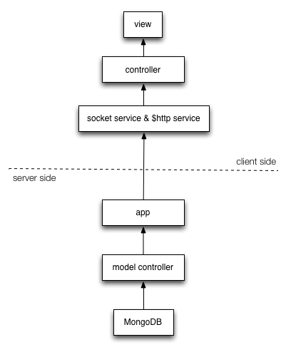

## 架构优化与发布

在本章中，我们将对前三章中一步步编写出来聊天室重新做一次梳理，进行一些优化，让整个项目更容易理解和扩展。其次我们还会介绍一些前端流行的工具，帮助我们构建项目，便于发布。

### 目前的项目结构

目前整个项目的架构如下图：



箭头代表了读取数据的流向，服务端和客户端基本上都分为三层：

- 服务端：在mongodb和mongoose之上，我们添加了一层模型的controller，这一层直接处理一些业务相关的逻辑；在这之上，我们直接通过http API或者socket.io将所提供的接口暴露出来；这一块的代码我们全部写在了app.js中；
- 客户端：针对不同的组件或者页面，我们对应了不同的controller，而这些controller都是通过$http或者socket service直接于服务端通信的；各个controller之间共享数据很困难。

总结一下：

- 将服务端的service逻辑从app.js分拆到http和socket service中
- 在客户端提供一个统一的数据接口层，向上为controller提供数据服务，向下和服务端通信，同步数据。

新的结构应该像下面这样：


### 分拆http和socket服务

首先简化app.js：

```
// ...

var api = require('./services/api')
var socketApi = require('./services/socketApi')

// ...
app.post('/api/login', api.login)
app.get('/api/logout', api.logout)
app.get('/api/validate', api.validate)

// ...

io.sockets.on('connection', function(socket) {

  socketApi.connect(socket)

  socket.on('disconnect', function() {
    socketApi.disconnect(socket)
  })

  socket.on('technode', function(request) {
    socketApi[request.action](request.data, socket, io)
  })
})

// ...
```


