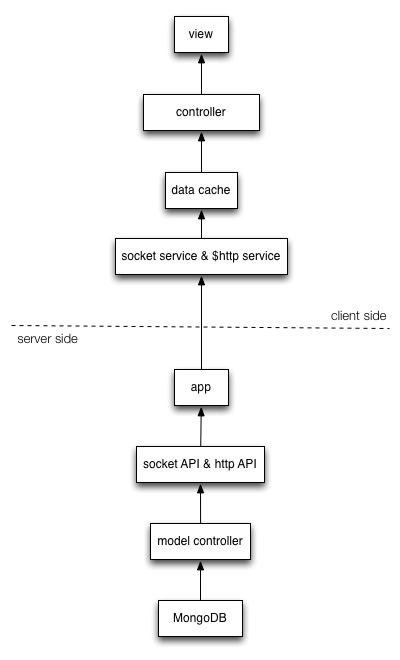

## 架构优化与发布

在本章中，我们将对前三章中一步步编写出来聊天室重新做一次梳理，进行一些优化，让整个项目更容易理解和扩展。其次我们还会介绍一些前端流行的工具，帮助我们构建项目，便于发布。

### 目前的项目结构

目前整个项目的架构如下图：


箭头代表了读取数据的流向，服务端和客户端基本上都分为三层：

- 服务端：在mongodb和mongoose之上，我们添加了一层模型的controller，这一层直接处理一些业务相关的逻辑；在这之上，我们直接通过http API或者socket.io将所提供的接口暴露出来；这一块的代码我们全部写在了app.js中；
- 客户端：针对不同的组件或者页面，我们对应了不同的controller，而这些controller都是通过$http或者socket service直接于服务端通信的；我们缺乏客户端的缓存机制。

总结一下，几点问题：

- 服务端认证不够明晰，认证模块应该独立出来，在请求进来时直接先检查后处理；
- 应该提供一套统一的RESTful API，无论是http还是socket.io都可以直接调用，调用风格一致；
- 实现客户端的数据缓存和同步层，让客户端维护业务逻辑。

新的结构应该像下面这样：



我们将会添加三个层来解决我们的问题。

### RESTful API

我们的数据接口分成两部分，一部分是基于HTTP的，一部分是socket，首先实现HTTP的。

#### HTTP

一套基于HTTP的RESTful API，既是基于URL和HTTP方法实现一套对数据库增删该查，首先我们先改写一下controller层，为每个数据模型实现create、remove、update和read接口，对应四个HTTP的方法POST、DELETE、UPDATE和GET。

```
var db = require('../models')
var _ = require('underscore')
var gravatar = require('gravatar')

exports.create = function(user, callback) {
  user.name = user.name || user.email.split('@')[0]
  user.avatarUrl = user.avatarUrl || gravatar.url(user.email)
  user = new db.User(user)
  user.save(callback)
}
exports.remove = function (_userId, callback) {
  db.User.findByIdAndRemove(_userId, callback)
}
exports.update = function (_userId, update, callback) {
  db.User.findByIdAndUpdate(_userId, update, callback)
}
exports.read = function (_userId, callback) {
  if (_.isObject(_userId)) {
    db.User.find(_userId, callback)
  } else {
    db.User.findById(_userId, callback)
  }
}
```

仅仅拿user举例，这四个方法基本上对应了mongoose的四个方法，在这里create有点稍稍的不一样，目标是客户端可以只提供user的email就可以创建user。其他模型的controller基本大同小异。
在`read`方法中，如果_userId是一个对象的话，就当做获取user列表。

再来看看app.js文件中的route：

```
app.use(express.bodyParser())
// ...
app.all('/api/:model/:_id?', httpApi)
```
我的RESTful API通过下面这样的URL提供出来：

- POST http://technode.im/users 创建用户
- GET http://technode.im/users/52b380a837a4f24736000001 读取用户
- DELETE http://technode.im/users/52b380a837a4f24736000001 删除用户
- PUT http://technode.im/users/52b380a837a4f24736000001 更新用户信息

因此我们使用这样的route表达我们的API`'/api/:model/:_id?'`。在httpApi中，我们可以通过req.route来获取route.params的信息，根据参数调用不同的模型方法。

最后，别忘了使用`app.use(express.bodyParser())`，这样的话express可以帮你parse好HTTP中body的数据。

```
var Controllers = require('../controllers')

module.exports = function(req, res, next) {
  if (Controllers.hasOwnProperty(req.route.params.model)) {
    model = req.route.params.model
    controller = Controllers[model]
    switch (req.route.method) {
      case 'post':
        controller.create(req.body, function (err, model) {
          if (err) {
            res.send(500, {error: err})
          } else {
            res.json(model)
          }
        })
        break
      case 'get':
        _id = req.route.params._id || {}
        controller.read(_id, function (err, model) {
          if (err) {
            res.send(500, {error: err})
          } else {
            res.json(model)
          }
        })
        break
      case 'put':
        _id = req.route.params._id
        if (!_id) {
          res.send(500, {error: '_id is need'})
        } else {
          controller.update(_id, req.body, function (err, model) {
            if (err) {
              res.send(500, {error: err})
            } else {
              res.json(model)
            }
          })
        }
        break
      case 'delete':
        _id = req.route.params._id
        if (!_id) {
          res.send(500, {error: '_id is need'})
        } else {
          controller.remove(_id, function (err, model) {
            if (err) {
              res.send(500, {error: err})
            } else {
              res.json(model)
            }
          })
        }
        break
    }
  }
}
```

我们通过`req.route.params来获取`model`和`_id`，而通过req.query获取HTTP GET方法传递的数据，通过req.body获取HTTP其他三个放传递的数据。剩下的就是调用controller对应的方法即可。

推荐大家使用一个chrome插件，POSTMAN，可以非常方便地调试接口。

#### socket

接下来我们来实现socket的接口。在这里我们使用socket将基于HTTP的RESTful接口暴露出来。客户端可以通过下面的方式与服务端通信：

```
socket.emit('technode', {
    method: 'post',
    model: 'users',
    data: {
      email: 'foo@bar.com'
    }
})
```

而服务端则会把添加用户的消息广播出来，客户端可以通过下面的方式接受服务端的消息：

```
socket.on('technode', function (data) {
  if (data.method === 'post' && data.model === 'users') {
    console.log('new user is added!')
  }
})
```

来看看服务端的实现：

```
var Controllers = require('../controllers')
var httpApi = require('./httpApi')

module.exports = function(socket, io) {
  socket.on('technode', function (request) {
    console.log(request)
    var req = {}
    var res = {}

    req.route = {}
    req.route.params = {
      model: request.model,
      _id: request._id
    }

    req.route.method = request.method

    if (request.method === 'get') {
      req.query = request.data
    } else {
      req.body = request.data
    }

    res.json = function (data) {
      if (request.method === 'get') {
        socket.emit('technode.' + request.requestId, {
          model: request.model,
          _id: request._id || data._id,
          method: request.method,
          data: data
        })
      } else {
        io.sockets.emit('technode', {
          model: request.model,
          _id: request._id || data._id,
          method: request.method,
          data: data
        })
      }
    }

    res.send = function (code, data) {
      console.log(data)
      socket.emit('technode', {
        code: code,
        data: data,
        request: request
      })
    }

    httpApi(req, res)

  })
}
```

我们完全重用了httpApi里的代码，只是将socket请求解析成了两个对象，req和res，实现了res.json和res.send方法，然后就可以喝HTTP请求一样共享RESTful里面的逻辑了。不过与之有点小差异：

- 除了'get'请求，其他请求是没有直接响应的，取而代之的是将模型的变化通知给所有的客户端；
- 对于'get'请求，则包是直接返回给请求客户端的，为了区分该客户端其他get请求，我们需要使用一个requestId来标示不同的'get'请求。

接下来，我们来实现客户端缓存，以及与服务端数据交换。

### 客户端缓存


